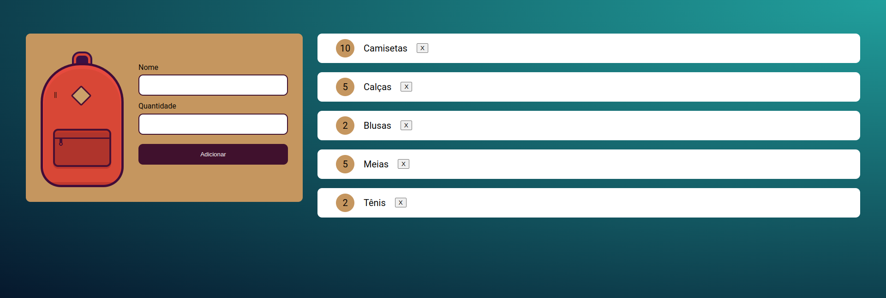

# Mochila de Viagem

Uma lista de itens para registrar tudo o que não se pode esquecer na hora de arrumar uma mochila para uma viagem. É possível adicionar itens, atualizar a quantidade e excluir algum item que não queira mais. Além disso, quando atualizado o navegador os itens continuam salvos para consultas futuras

| :placard: Vitrine.Dev |     |
| -------------  | --- |
| :sparkles: Nome        | **Mochila de Viagem**
| :label: Tecnologias | HTML, CSS e JavaScript
| :rocket: URL         | https://mochila-de-viagem-gilt.vercel.app/
| :fire: Desafio     | -

## Detalhes do projeto

Projeto usando HTML, CSS e JavaScript com foco no uso e da manipulação do Local Storage. Nesse projeto aprendi: 
 • Interajir com a página e com LocalStorage;  
• Crie objetos no JavaScript;  
• Registre dados no LocalStorage;  
• Implementar páginas WEB que armazenam dados;  

## Screenshots

## Desktop
</img>
